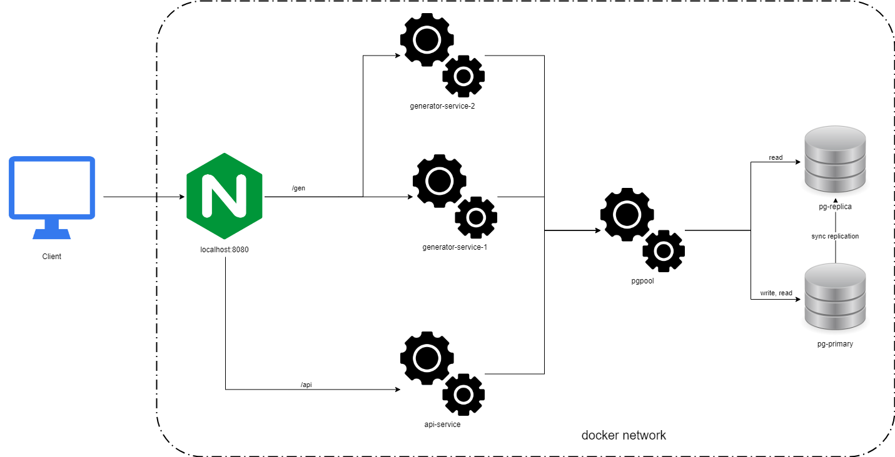

Демо-проект, который создал при изучении работы с балансировщиками.

В проекте Nginx используется больше как маршрутизатор между сервисами /api и /gen, а балансировка по репликам производится средствами Docker. Так можно менять количество реплик без обновления конфигурации Nginx. Для БД внес изменения в готовую конфигурацию с pgpool.

Для запуска необходимо выполнить команду:

```docker-compose up -d```

Общая схема взаимодействия сервисов в проекте:
